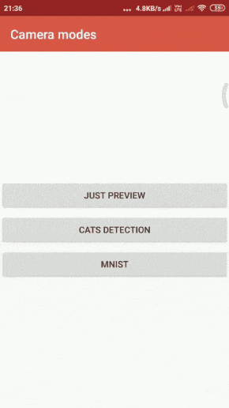

# XamarinCamera2App
Created to learn about computer vision/ machine learning.

## General workflow

Machine learning models are created in python, and then they are coverted to tflite models and could be used in Xamarin with the help of [TensorflowLite](https://github.com/xamarin/XamarinComponents/tree/master/XPlat/TensorFlow.Lite) package.

## Demo
 
 
## Nuget package dependencies

[TensorflowLite](https://github.com/xamarin/XamarinComponents/tree/master/XPlat/TensorFlow.Lite)

[SkiaSharp](https://github.com/mono/SkiaSharp)

[Kawaian.OpenCVSharp](https://github.com/Kawaian/OpenCvSharp)
